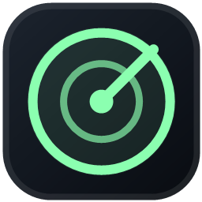

# QuotaHalo

QuotaHalo is a private, local Windows dashboard for live AI coding-session token usage and quota limits. It reads local Codex Desktop session events and turns them into a polished, resizable, always-on-top monitor.

> QuotaHalo is an unofficial community project. It is not affiliated with, endorsed by, or sponsored by OpenAI.



## Features

- Current request context usage against the reported model context window
- Session input, output, cached input, reasoning output, and total tokens
- Primary and secondary quota usage with live reset countdowns
- Recent context activity and session switching
- Full, Compact, and Mini window modes
- Mini mode shows context plus both quota windows, or a configurable single window
- Drag the window from any non-interactive surface
- Always-on-top pin, system tray, remembered position, and adjustable opacity
- Midnight, graphite, and light themes with four accent colors
- Configurable local sessions folder and refresh interval

The context card uses `last_token_usage`. Session metric cards use the cumulative `total_token_usage` reported for that session. QuotaHalo does not estimate pricing.

## Privacy

QuotaHalo operates entirely on your device. It does not include analytics, telemetry, accounts, or network calls.

Only session metadata and `token_count` events are passed from the Electron main process to the dashboard. Prompts, assistant responses, authentication files, and tool output are not exposed to the renderer or transmitted anywhere.

By default, QuotaHalo reads:

```text
%USERPROFILE%\.codex\sessions
```

If `CODEX_HOME` is set, its `sessions` directory is used instead. You can choose another source in Settings.

## Install

Download the latest portable Windows executable from the repository's **Releases** page and run it. Windows may show a SmartScreen warning until public releases are signed and establish reputation.

For development:

```powershell
npm install
npm start
```

## Test and build

```powershell
npm test
npm run dist
```

The Windows artifact is written to `release/QuotaHalo-<version>-x64.exe`.

## Keyboard and window controls

- `Ctrl+R`: refresh now
- `Esc`: close Settings
- Window-size button: cycle Full → Compact → Mini
- Closing the window: hide to the system tray by default
- Tray menu: show/hide, window size, pin, refresh, or quit

## Compatibility

QuotaHalo currently supports the local JSONL session format produced by Codex Desktop. That format is not a public stability contract and may change. Please open an issue if a Codex update breaks detection.

## Contributing

Issues and pull requests are welcome. Read [CONTRIBUTING.md](CONTRIBUTING.md) before submitting changes. Security issues should be reported according to [SECURITY.md](SECURITY.md), not opened publicly.

## License and marks

Source code is licensed under [GPL-3.0-only](LICENSE). Copyright © 2026 sanoobis.

The QuotaHalo name and logo are reserved marks of sanoobis and are not granted for use by the GPL license except as necessary to describe the origin of the software. See [TRADEMARKS.md](TRADEMARKS.md).
